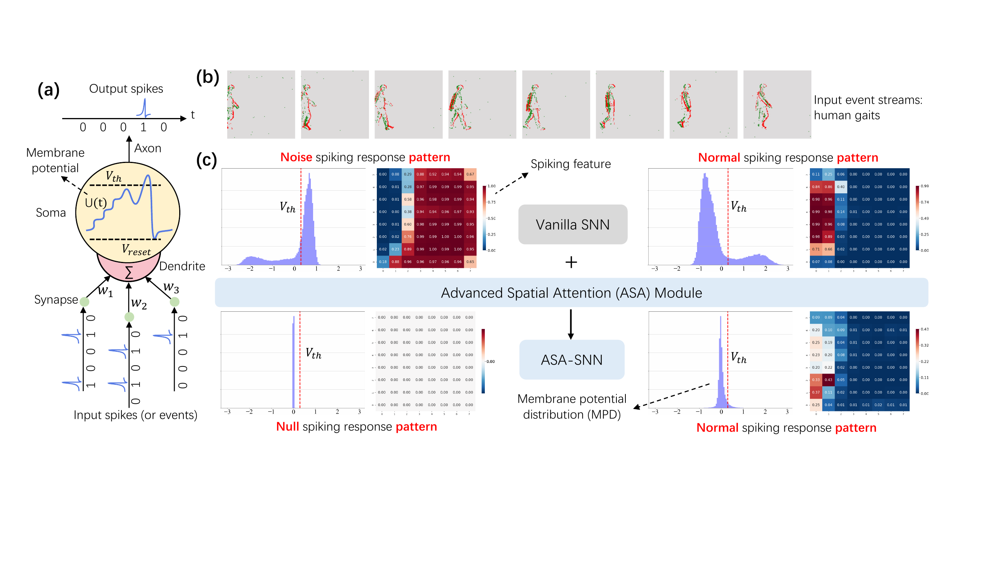

# Inherent Redundancy in Spiking Neural Networks ICCV2023

Spiking Neural Networks (SNNs) are well known as a promising energy-efficient alternative to conventional artificial neural networks. Subject to the preconceived impression that SNNs are sparse firing, the analysis and optimization of inherent redundancy in SNNs have been largely overlooked, thus the potential advantages of spike-based neuromorphic computing in accuracy and energy efficiency are interfered. In this work, we pose and focus on three key questions regarding the inherent redundancy in SNNs. We argue that the redundancy is induced by the spatio-temporal invariance of SNNs, which enhances the efficiency of parameter utilization but also invites lots of noise spikes. Further, we analyze the effect of spatio-temporal invariance on the spatio-temporal dynamics and spike firing of SNNs. Then, motivated by these analyses, we propose an Advance Spatial Attention (ASA) module to harness SNNs' redundancy, which can adaptively optimize their membrane potential distribution by a pair of individual spatial attention sub-modules. In this way, noise spike features are accurately regulated. Experimental results demonstrate that the proposed method can significantly drop the spike firing with better performance than state-of-the-art baselines.



Our module's details are in `./models/module/Attn.py`.

## train & test

### requirements

- python >= 3.7
- torch >= 1.10
- torchvision >= 0.11
- spikingjelly == 0.0.0.0.12
- h5py
- pandas
- einops
- seaborn: only for plot features
- torchinfo: only for see the details of networks

### quick-start

```shell
sh final.sh
```

### train on your own dataset

```shell
CUDA_VISIBLE_DEVICES=0 python3 train_test.py                   \
    -arch A                     \
    -T 60                       \
    -attention ASA              \
    -dataset yourdata           \
    -data_path DATA_PATH        \
    -batch_size_train 32        \
    -batch_size_test 4          \
    -clip 10                    \
    -num_epochs 200             \
    -seed 0                     \
    -ps 00011
```

### args' helper

```shell
python3 train_test.py -h
```

1. `arch`: A for three-layer SNN; B for five-layer SNN
2. `T`: the time steps you want to set
3. `attention`: the module you want to use, "no" or "ASA" in this project
4. `dataset`: the dataset you want to use
5. `data_path`: the path of your dataset
6. `batch_size_train / test`: the batch-size used in training and inference
7. `clip`: the times you want to set for data augments algorithm "RCS"
8. `num_epochs`: the epochs you want to set
9. `seed`: the random seed you want to set
10. `ps`: the dropput is on / off on different layers

> configs' details could be seen in `./config.py`

## performance

| Dataset | Model | Acc.(%) | NASFR
| -- | -- | -- | -- |
| DVS128 Gesture | LIF-SNN | 91.3 | 0.176 |
| | . + ASA | 95.2(**+3.9**) | 0.038(**-78.4%**) |
| DVS128 Gesture by spikingjelly | LIF-SNN-Five | 95.5 | 0.023 |
| | . + ASA | 97.7(**+2.2**) | 0.018(**-21.7%**) |
| DVS128 Gait-day | LIF-SNN | 88.6 | 0.214 |
| | . + ASA | 93.6(**+5.0**) | 0.045(**-78.9%**) |
| DVS128 Gait-night | LIF-SNN | 96.4 | 0.197 |
| | . + ASA | 98.6(**+2.2**) | 0.126(**-36.0%**) |
| DailyAction-DVS | LIF-SNN | 92.5 | 0.017 |
| | . + ASA | 94.6(**+2.1**) | 0.013(**-23.5%**) |
| HAR-DVS | SEW-Res-SNN-18 | 45.5 | 0.206 |
| | . + ASA | 47.1(**+1.6**) | 0.183(**-11.2%**) |

## Contact Information

For help or issues using this git, please submit a GitHub issue.

For other communications related to this git, please contact `manyao@stu.xjtu.edu.cn` and `jkhu29@stu.pku.edu.cn`.
